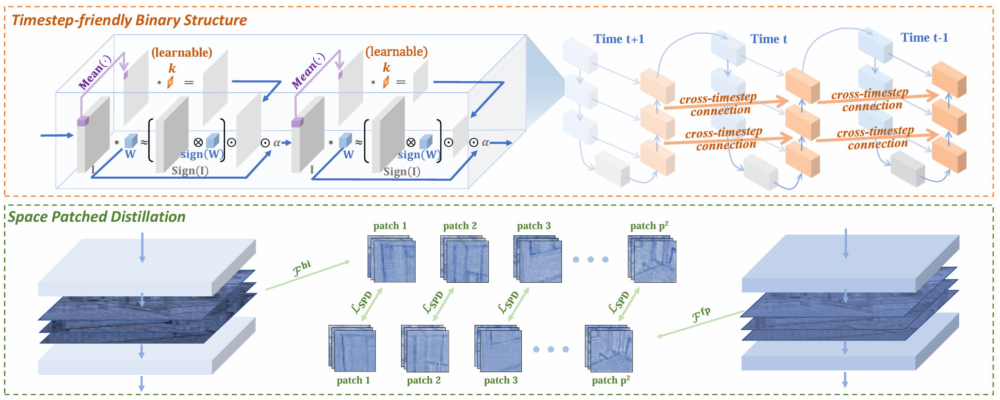

# BiDM: Pushing the Limit of Quantization for Diffusion Models
This project is the official implementation of our “BiDM: Pushing the Limit of Quantization for Diffusion Models”. [[PDF](https://openreview.net/pdf?id=oWAItGB8LJ)]



### Requirements

Establish a virtual environment and install dependencies as referred to [latent-diffusion](https://github.com/CompVis/latent-diffusion).

### Usage

- Replace the existing `main.py` in the LDM with our version of `main.py`.
- Place `openaimodel_ours.py` and `util_ours.py` in the directory `./ldm/modules/diffusionmodules`.
- Place `ddpm_ours.py` and `ddim_ours.py` in the directory  `./ldm/models/diffusion`
- run `bash train.sh`

#### Main Results

- Results for LDM in unconditional generation by DDIM with 100 steps.


#### Visualization Results

- Samples generated by the binarized DM baseline and BiDM under W1A1 bit-width.


## Comments

- Our codebase builds on [latent-diffusion](https://github.com/CompVis/latent-diffusion) and [stable-diffusion](https://github.com/CompVis/stable-diffusion). Thanks for open-sourcing!

## BibTeX

If you find *BinaryDM* is useful and helpful to your work, please kindly cite this paper:

```
@inproceedings{zhengbidm,
  title={BiDM: Pushing the Limit of Quantization for Diffusion Models},
  author={Zheng, Xingyu and Liu, Xianglong and Bian, Yichen and Ma, Xudong and Zhang, Yulun and Wang, Jiakai and Guo, Jinyang and Qin, Haotong},
  booktitle={The Thirty-eighth Annual Conference on Neural Information Processing Systems}
}
```


